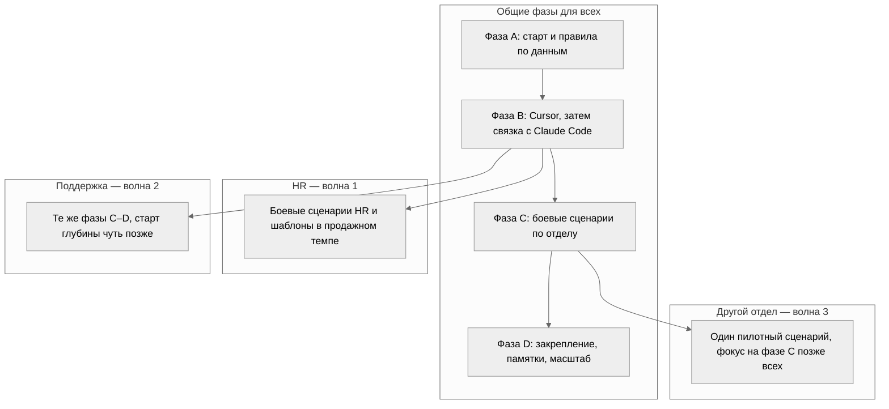

# План обучения опорных пользователей: Cursor и Claude Code

**Назначение:** программа на **8 недель (около двух месяцев)** для людей, которые ведут внедрение ИИ в отделах. Язык и шаги рассчитаны на **нетехнических** коллег.

**Источник контекста по отделам:** заметка Granola от 2026-03-25 (постепенный rollout по **HR, поддержка, другие отделы**; короткие демонстрации; база знаний; связка с календарём, почтой, чатами; обратная связь от специалистов в поле).

**Инструменты:** **Cursor** (редактор с ИИ) и **Claude Code** (ИИ, работающий с целой папкой проекта через терминал). Не путать с «Cloud Code».

---

## Кто такие «сильные специалисты» в этом плане

Это не айти-отдел ради кода. Это **опорные люди в каждом направлении** (HR, поддержка, затем другие отделы), которые:

- осваивают понятные сценарии на ИИ;
- соблюдают правила по чувствительным данным;
- помогают коллегам не утонуть в инструментах;
- передают обратную связь тем, кто настраивает систему и базу знаний.

Ниже их можно называть **амбассадорами** или **опорными пользователями**.

---

## Два инструмента простыми словами

**Cursor** — привычный редактор текста и файлов, внутри которого встроен помощник на ИИ. Удобно открыть документ, задать вопрос по нему, попросить переписать абзац, сравнить два варианта. Мало трения, не нужно «как в консоли».

**Claude Code** — режим, когда ИИ действует **от имени целой папки проекта** (репозитория): может последовательно пройтись по нескольким файлам, применить одно правило во многих местах, собрать сводку из разных документов по шаблону. Сильнее для объёмных и повторяющихся задач, но **порог входа выше**: чаще нужен терминал и ясная структура папок.

**Сочетание:** в Cursor живёт **ежедневная работа с текстом и точечные правки**. Claude Code подключают, когда задача звучит как «пройти по всему проекту», «обновить всё по одному правилу», «собрать одну картину из многих файлов». Обучение учит **не путать эти два режима** и не тащить в чат Cursor лишнее, что лучше делать через Claude Code.

### Плюсы и минусы Cursor

- **Плюсы:** быстро, наглядно, удобно для тех, кто не привык к терминалу; хорош для черновиков писем, политик, инструкций, когда в фокусе один-два файла.
- **Минусы:** если контекст размазан по многим файлам, вручную «скормить» всё чату тяжело; без дисциплины возможен хаос в правках.

### Плюсы и минусы Claude Code

- **Плюсы:** один запрос может охватить **много файлов согласованно**; проще поддерживать **единые шаблоны** (например, обновить все чек-листы поддержки одной командой).
- **Минусы:** нужно объяснить, где лежит проект и какие файлы трогать нельзя; без правил по данным выше риск «задеть лишнее» масштабом.

---

## Общие правила до любого инструмента

Перед неделями с Cursor и Claude Code опорные пользователи проходят **одну общую рамку**:

- какие сведения можно класть в обычный чат с внешней моделью;
- что только во внутренние системы;
- что нельзя отправлять никуда без отдельного разрешения;
- что делать, если не уверены: **не гадать**, а спросить у ответственного за безопасность или юридический контур.

Цель: чтобы люди **не боялись** там, где можно, и **не ломали правила** там, где нельзя.

---

## Roadmap по отделам: волны и скорость внедрения

**Важно:** если старт даём с **HR**, они идут **первой волной**. У них **короче путь от «учимся» до «работает в ежедневной практике»**: общие недели 1–4 они проходят вместе со всеми, но **боевые сценарии и закрепление по HR** мы выводим в рабочий режим **раньше**, чем у поддержки и тем более чем у «других отделов». Поддержка подключается ко **второй волне** (сдвиг по времени и по зрелости шаблонов). **Третья волна** — один пилотный отдел из «остальных», когда уже есть живой пример от HR (и частично от поддержки).

Ниже: **плашки по отделам** (что внедряем и зачем) и **схема**, как дорожки ложатся друг на друга.

### Плашка: HR — волна 1, самый быстрый цикл реализации

- **Зачем первыми:** коммуникации с людьми и персональные данные задают **тон всей программе** (политика, тональность, шаблоны писем). Когда HR отладил сценарии и памятки, проще переносить дисциплину в другие отделы.
- **Что внедряем по смыслу:**
  - **Недели 1–4:** общий старт для всех + **первые HR-шаблоны** в учебной папке (письма, онбординг), чтобы не ждать «идеальной поддержки».
  - **Недели 5–6:** **полный набор боевых сценариев HR** (письма по воронке, сверка с политиками, сбор онбординга), опорный пользователь HR ведёт **разбор ошибок** для всей группы.
  - **Недели 7–8:** HR выходит на режим **«обновляем шаблоны и тон по факту»** (Claude Code для массовой правки папки шаблонов по согласованному правилу), плюс **передача лучших практик** поддержке и пилотному отделу.
- **Темп относительно других:** дорожная карта HR **заканчивает ключевые вехи раньше** на **примерно одну фазу** по сравнению с поддержкой (то, что у поддержки ещё «дотачивается», у HR уже в регулярной эксплуатации).

### Плашка: Поддержка — волна 2, та же структура, но сдвиг

- **Зачем вторыми:** им нужны **стабильные шаблоны тикетов и эскалаций** и согласованность с базой знаний; часть этого проще выстроить, когда **общие правила и репозиторий** уже «потрогали» на HR.
- **Что внедряем по смыслу:**
  - **Недели 1–4:** общий старт + учебные шаблоны поддержки в той же папке, но **глубокий разбор тикетов** начинаем после того, как группа освоила связку Cursor и Claude Code.
  - **Недели 5–6:** **фокус на боевых сценариях поддержки** (черновик ответа, сводка переписки, формат эскалации); HR в это время уже может **делиться** опытом по дисциплине данных.
  - **Недели 7–8:** поддержка доводит **единый формат эскалации и обновление всех шаблонов** в папке (часто через Claude Code после смены продукта или процесса).
- **Темп:** реализация roadmap **на шаг позже HR** по «боевому» статусу, но к концу недели 8 оба направления на одном уровне **зрелости процесса**.

### Плашка: Другие отделы — волна 3, один пилот

- **Зачем позже и узко:** не распылять сопровождение; **один отдел** (например, внутренние продажи или операции) получает **один сквозной сценарий** после того, как HR уже показал живой цикл.
- **Что внедряем:** один именованный сценарий с входом, выходом, инструментом и границами данных; памятка на языке этого отдела (не копия HR).
- **Темп:** **самый длинный** путь до уверенной эксплуатации, потому что старт позже и меньше часов сопровождения.

### Схема: как дорожки ложатся во времени (относительно, не календарь замены работы)

Ниже не даты из календаря, а **порядок волн**: HR проходит те же **именованные фазы**, но **раньше выходит на «работает каждый день»** по своим сценариям.

**Как читать схему:** общая подготовка (фазы A и B) **общая для всех**. Дальше **HR** первым выводит **свою** фазу C в рабочий ритм; **поддержка** наращивает ту же фазу C с небольшим сдвигом; **пилот третьего отдела** подключается к фазе C, когда HR уже дал устойчивый пример.

### Сводка «зачем что» одним списком

1. **HR первыми:** быстрее **закрывают** дорожную карту по своим сценариям и становятся **эталоном** по тону и данным.
2. **Поддержка вторыми:** получают **отполированные** общие правила и репозиторий, но их **своя** скорость до полного внедрения **ниже**, чем у HR на середине программы.
3. **Один другой отдел:** **самый поздний** и **узкий** трек, зато без перегруза команды сопровождения.

**Спринты (по две недели):** ниже в каждом блоке «Недели …» заданы **цель спринта как у команды в Scrum**: одна **общая цель** на всех опорных пользователей и отдельный **фокус** для **HR**, **поддержки** и **пилотного другого отдела** (если он уже в игре). На ретро и демо удобно проверять не «обсудили ли тему», а **достигли ли формулировки цели** для своего направления.

---

## Недели 1–2: старт, база знаний, первые сценарии в Cursor

**Спринт 1 из 4.**

**Общая цель спринта (все отделы):** все опорные пользователи понимают, *зачем* им ИИ и *где* живут правила и документы (интеграция с системой знаний); каждый **один раз** прошёл полный цикл в Cursor на безопасном примере и зафиксировал, что сработало и что нет.

### Цели спринта по отделам (фокус, как в Scrum)

- **HR:** в общем каталоге сценариев появились **первые именованные** HR-вехи (например письмо кандидату, фрагмент онбординга) **только на обезличенных текстах**; опорный HR на демо показывает **один** проход «запрос → черновик → проверка человеком».
- **Поддержка:** в том же каталоге зафиксированы **первые** сценарии первой линии (черновик ответа, сжатие длинного письма или проверка шагов инструкции); опорный из поддержки показывает **один** такой проход на учебном тексте.
- **Другой отдел (пилот):** если отдел уже выбран — согласованы роль **наблюдателя**, границы данных и то, **что не трогаем** до спринта 3; если пилота ещё нет — зафиксировано, **кто** и **до какой даты** предложит кандидата и один будущий сценарий.

**Шаги по смыслу:**

1. Знакомство с ролью опорного пользователя: не «все вопросы к тебе», а **сбор обратной связи**, помощь коллегам с первыми шагами, фиксация типовых затыков.
2. Один общий **каталог сценариев** в простом виде: какой запрос, какой тип данных, какой инструмент, какой результат. Без программистских терминов в заголовках.
3. **Cursor:** три живых примера на реальных текстах (не абстрактных): черновик ответа клиенту, сжатие длинного письма, проверка списка шагов в инструкции. Демонстрации короткие (до нескольких минут на пример), как в заметке Granola.
4. Связка с **календарём, почтой, рабочим чатом** в смысле *процесса*: не обязательно настроить всё технически в первую неделю, но объяснить: напоминание и заготовка к встрече — типовой сценарий, который потом можно упростить или автоматизировать.

**Итог двух недель:** каждый опорный пользователь **один раз** прошёл полный цикл: взял свой безопасный пример, получил результат в Cursor, записал, что понравилось и что смутило.

---

## Недели 3–4: Claude Code как «режим для всего проекта» и первая связка с Cursor

**Спринт 2 из 4.**

**Общая цель спринта (все отделы):** разница между Cursor и Claude Code проверена на **одной сквозной задаче** в учебной папке; каждый может **словами** объяснить коллеге, когда работать за «столом», а когда идти в «мастерскую по всему складу».

### Цели спринта по отделам (фокус, как в Scrum)

- **HR:** в учебном репозитории отработаны шаблоны **описания вакансии** и **онбординга** в связке: правка **одного** документа в Cursor и **одно** осмысленное действие на уровне папки в Claude Code (например согласовать формулировку во всех шаблонах или собрать список открытых вопросов).
- **Поддержка:** отработаны **типовой ответ** и **эскалация** в той же двухшаговой связке; у команды поддержки ясно, какие **папки и файлы** в учебном проекте трогать нельзя (имитация конфиденциальной зоны).
- **Другой отдел (пилот):** для будущего спринта 3 выбран **ровно один** именованный сценарий (название, вход, выход, какой класс данных); в репозитории или в бэклоге лежат **заготовки без прод-данных**.

**Шаги по смыслу:**

1. Простая метафора на весь блок: **Cursor — стол**, **Claude Code — мастерская по всему складу**. На стол кладём то, с чем работаем сейчас; в мастерскую идём, когда нужно обойти весь склад по одному правилу.
2. Один общий **учебный репозиторий** (папка с шаблонами): например, заготовки для HR (описание вакансии, чек-лист онбординга) и для поддержки (ответ по типовой ошибке, эскалация). Только обезличенные примеры, без настоящих персональных данных.
3. Упражнение в два шага:
   - в **Cursor** правят один документ под конкретный кейс;
   - в **Claude Code** делают **одно** осмысленное действие на уровне папки: например, найти во всех шаблонах устаревшее слово и заменить формулировку на согласованную, или собрать из нескольких файлов один список открытых вопросов.  
   Заранее сказать, **какие файлы трогать нельзя** (имитация конфиденциальной зоны).

**Итог четырёх недель:** опорные пользователи **один раз сделали связку** Cursor → Claude Code на учебных данных и могут словами объяснить коллеге, когда что включать.

---

## Недели 5–6: углубление по отделам (HR, поддержка, задел под другие)

**Спринт 3 из 4.**

**Общая цель спринта (все отделы):** у каждого направления есть **два–три именованных сценария** (как названия рецептов) с понятным входом, выходом, инструментом и границами по данным; проведён **минимум один** реальный прогон на разрешённых или обезличенных данных с короткой записью «что сэкономили» и «что пошло не так».

### Цели спринта по отделам (фокус, как в Scrum)

- **HR:** **полный набор** боевых сценариев HR в рабочем контуре (письма по воронке, сверка формулировок с политиками, сбор первой недели онбординга из разрозненного); опорный HR на общей встрече ведёт **разбор типовых ошибок** (данные, тон, отправка без проверки). При старте программы с HR это **главная фокус-цель спринта** для всей группы по «волне 1».
- **Поддержка:** **боевые** сценарии первой линии: черновик по типовому кейсу, сводка «что уже пробовали», единый формат эскалации; к концу спринта зрелость **близка** к HR, с допустимым отставанием по **волне 2** (см. Roadmap выше).
- **Другой отдел (пилот):** **один** сквозной сценарий доведён до состояния «есть **памятка** на языке отдела и **один** полный прогон»; памятка не копирует HR дословно.

### В чём суть этих двух недель (не только «отделы разные»)

К неделям 1–4 люди уже понимают, **как** нажимать на инструменты и **где** граница по данным. Недели 5–6 нужны затем, чтобы перейти от учебных примеров к **реальной работе отдела**, где у каждого направления **свой главный риск** и **свой главный выигрыш**.

- **HR** в первую очередь про **репутацию работодателя, доверие кандидата и соблюдение правил** про персональные данные. Если ИИ помогает «быстро», но тексты разъезжаются по тону или в чат утекает лишнее, выигрыша нет, появляется вред.
- **Поддержка** в первую очередь про **скорость первого ответа, повторяемость качества и чистую передачу дежурству** (чтобы следующий человек не разбирался с нуля). Здесь ошибка чаще не в «красивом слове», а в том, что клиент получил не то, что обещали, или эскалация ушла без фактов.

Смысл недель 5–6: у каждого направления появляются **именованные сценарии** (как названия рецептов), **понятный вход и выход**, **кто несёт ответственность за финальный текст**, и чёткое понимание **когда достаточно Cursor**, а **когда нужен Claude Code** (массовая правка по папке или сборка одного отчёта из многих файлов).

Ниже расписано подробно по отделам и в конце, что делать с «другими отделами». Если программа стартует с **HR**, в эти две недели **HR** выходит на **полный набор именованных сценариев** и режим «черновик плюс проверка человеком» **раньше**, чем поддержка доводит тот же уровень зрелости; детали волн и темпа — в разделе **Roadmap по отделам** выше.

---

### HR: суть боли и что именно вы отрабатываете

**Что обычно болит без нормального процесса ИИ:**

1. Люди тратят время на **однотипные письма** (подтверждение получения, отказ с мягкой формулировкой, напоминание о следующем шаге), а тон и факты в письмах **плывут** между рекрутерами.
2. **Онбординг** размазан по письмам, чатам и внутренним заметкам: новый сотрудник не понимает, что главное в первую неделю, а HR каждый раз собирает это заново.
3. Регуляторика и внутренние политики **не читаются как роман**, а нужны **сверка формулировок** в конкретных ситуациях: «можно ли так написать в письме кандидату», а не «перескажи всю политику».

**Что в этих неделях считается успехом (по-человечески):**

- рекрутер не отправляет в модель **сырые персональные данные кандидатов** (или отправляет только по правилам: обезличенные фрагменты, согласованный канал);
- на выходе есть **черновик**, который человек **прочитал и поправил** перед отправкой (ИИ не «подписал» письмо вместо компании);
- есть **один согласованный тон** письма (дружелюбно, нейтрально, официально) и он не меняется от случая к случаю без причины.

**Сценарий 1: письмо кандидату на любом этапе воронки**

- **Вход:** обезличенное описание ситуации (этап воронки, что уже сказали кандидату, что нужно сообщить сейчас, ограничения по срокам). Без фамилии, почты и телефона в промпте, если политика это запрещает, или только во внутреннем контуре.
- **Действие в Cursor:** открыть шаблон письма в репозитории знаний, вставить ситуацию в чат, попросить **два варианта тона** (мягче и жёстче) и **короткую версию** для длинного письма.
- **Выход:** черновик в том же файле или рядом, с пометкой «черновик, не отправлять без проверки».

**Сценарий 2: сверка формулировки с политикой (не замена юристу)**

- **Суть:** ИИ помогает **сопоставить** ваш черновик с **выдержками** из уже утверждённых внутренних документов (которые лежат у вас в базе знаний как отдельные файлы). Это не «юридическое заключение», а **напоминание**: «в такой фразе возможна двусмысленность, сравни с пунктом X».
- **Инструмент:** в основном **Cursor**, потому что вы работаете с **одним письмом** и **одним-двумя файлами политики** рядом на экране.
- **Граница:** если вопрос про правовые последствия, **человек и юрист**, а не модель.

**Сценарий 3: «собрать первую неделю онбординга» из разрозненного**

- **Суть:** у вас в папке лежат пять разных заметок (чек-лист IT, приветствие от бuddy, ссылки на системы). Нужно **один линейный чек-лист для новичка**: день 1, день 3, конец недели, без дублирования.
- **Инструмент:** если файлов много и они длинные, удобнее **Claude Code**: задать задачу «прочитать только файлы из папки онбординга и собрать один markdown-чеклист по шаблону». Если файлов два и они короткие, можно **Cursor** вручную.
- **Контроль:** финальная версия проходит проверку HR, и только потом попадает в рассылку новичкам.

**Типичные ошибки на HR-треке (их проговаривают вслух на неделе 5):**

- вставить в чат **полное резюме** или **контакты** кандидата без классификации данных;
- отправить кандидату текст, **не прочитав** (ИИ иногда уверенно врёт в деталях);
- использовать **одну и ту же** «теплую» формулировку отказа, когда **политика компании** требует другой регистр.

---

### Поддержка: суть боли и что именно вы отрабатываете

**Что обычно болит без нормального процесса ИИ:**

1. Агент первой линии **теряет время** на формулировку, хотя ответ уже был в базе знаний, просто не найден.
2. В тикете **копятся** десять сообщений, и **нет короткой сводки** того, что уже пробовали: второй линии приходится читать переписку с начала.
3. Эскалация уходит **без пакета фактов** (версия продукта, шаги воспроизведения, что уже сделали), и эскалация превращается в переписку «а у вас точно…».

**Что в этих неделях считается успехом:**

- **Первый ответ** быстрее не за счёт «магии», а за счёт **черновика по шаблону** и ссылок на **проверенные** статьи базы;
- в каждом тикете есть **короткий блок «уже сделано»** перед эскалацией;
- эскалация в **одном формате**, чтобы дежурный второй линии открыл и понял за две минуты.

**Сценарий 1: черновик ответа по типовому кейсу**

- **Вход:** обезличенное описание проблемы (что видит клиент, какой продукт, без имён аккаунта, если политика требует), плюс **номер или название** статьи из внутренней базы, если она уже есть.
- **Действие в Cursor:** открыть шаблон ответа, вставить факты, попросить **ответ в трёх абзацах**: признание проблемы, шаги, что делать дальше если не помогло.
- **Выход:** черновик, который агент **сверяет** с базой и только потом отправляет.

**Сценарий 2: «что уже пробовали» из длинной переписки**

- **Суть:** клиент написал пять сообщений. Нужен **блок из пяти пунктов**: что предлагали, что клиент ответил, какой статус сейчас.
- **Инструмент:** **Cursor** на открытом тексте тикета (обезличенном для учебы или в учебном контуре). Запрос: «выдели хронологию действий и открытые вопросы».
- **Зачем:** чтобы следующий не читал «роман», а видел **карточку ситуации**.

**Сценарий 3: единый формат эскалации**

- **Суть:** не свободное письмо, а **фиксированные поля**: продукт, среда, шаги воспроизведения, ожидание и факт, что уже сделали, срочность, приложения (логи только если политика позволяет).
- **Инструмент:** **Cursor** для заполнения полей из текста переписки; **Claude Code**, если нужно **одновременно обновить все шаблоны эскалации** в папке (например, после смены названия продукта или добавления обязательного поля), чтобы не править десять файлов руками.

**Типичные ошибки на поддержке:**

- **полагаться** на ИИ вместо актуальной статьи базы (устаревший совет);
- вставлять в чат **логи с персональными данными**;
- отправлять клиенту текст, **не проверив**, что шаги актуальны для его версии.

---

### Другие отделы: зачем они в этих же неделях

В заметке Granola сказано: rollout **постепенный**, поэтому «другие отделы» не значит «все сразу». Смысл **одного пилотного отдела второго эшелона** (например, внутренние продажи, операции, финансы в части внутренних отчётов):

- проверить, что ваши **шаблоны инструкций** не написаны только языком HR и поддержки;
- найти **один реальный сценарий** за две недели: вход, выход, инструмент, границы данных;
- не раздувать обучение: **один отдел, один сценарий**, зато с доведением до конца.

Практический критерий: если человек из другого отдела читает вашу памятку и **не узнаёт свои слова**, значит, неделя 5–6 для этого отдела ещё не началась.

---

### Инструменты на неделях 5–6 (когда что, без абстракции)

- **Cursor** почти каждый день: **одно письмо, один тикет, одна политика рядом**, правки на экране, человек видит контекст.
- **Claude Code** точечно, когда задача звучит как «**обновить все файлы** в папке по одному правилу» или «**собрать один документ** из десяти кусков по одному шаблону». Перед запуском: **какие папки трогать**, **какие нельзя**, **какой класс данных** в этих файлах.

---

### Итог шести недель (что должно быть на столе у каждого направления)

1. **Два или три сценария с названиями**, не «ИИ для HR», а например: «Письмо кандидату после интервью», «Чек-лист первой недели из разрозненных заметок», «Эскалация второй линии в фиксированном формате».
2. Для каждого сценария: **вход / выход / инструмент (Cursor или Claude Code) / кто утверждает / что нельзя класть в модель**.
3. **Один реальный прогон** (не учебный абстрактный) на обезличенных или разрешённых данных, с записью «что сэкономили по времени» и «что пошло не так».

---

## Недели 7–8: закрепление, обратная связь с поля, следующий круг

**Спринт 4 из 4.**

**Общая цель спринта (все отделы):** из пилота сделать **устойчивую привычку** и понятный вход для новых людей; собрана **обратная связь с поля**, обновлены **короткие инструкции** (не больше одной страницы на сценарий); согласован **план на следующий месяц** (ещё один отдел или углубление в HR и поддержке).

### Цели спринта по отделам (фокус, как в Scrum)

- **HR:** шаблоны и тон обновляются по **согласованным правилам**, в том числе через **массовые правки** в папке (Claude Code после смены формулировки или продукта); опорный HR передаёт **лучшие практики** поддержке и пилотному отделу (короткая сессия или памятка).
- **Поддержка:** **единый формат эскалации** и актуализация **всей** папки шаблонов после изменений процесса или продукта; к концу спринта **паритет зрелости процесса** с HR по согласованным критериям (не обязательно одинаковый объём тикетов, но одинаковая дисциплина «черновик — проверка — отправка»).
- **Другой отдел (пилот):** итог пилота **зафиксирован**: продолжаем / корректируем сценарий / переносим на следующий круг; одна строка в плане на следующий месяц.

**Шаги по смыслу:**

1. **Сессия обратной связи** от опорных пользователей (в Granola: сбор отзывов от специалистов в поле): что зашло, где было неловко, где инструмент не помог.
2. Обновление **коротких инструкций** на человеческом языке (не больше одной страницы на сценарий).
3. Мини-проверка по данным: не техническая, а на уровне вопросов: «мы случайно не складываем в общий чат то, что должно остаться в закрытой системе?»
4. План на следующий месяц: расширение на **ещё один отдел** или углубление в HR и поддержке, в зависимости от того, где больше боли.

**Итог восьми недель:** опорные пользователи умеют **объяснить нетехническому руководителю**, зачем два инструмента, **когда** включать Cursor, **когда** Claude Code, и как это стыкуется с правилами по данным и с базой знаний.

---

## Как читать сроки: месяц или два

- **Минимум в один месяц:** недели 1–4 полностью (старт, Cursor, первое знакомство с Claude Code, одна связка Cursor и Claude Code на учебной папке).
- **Расширение до двух месяцев:** недели 5–8 (отдельные треки HR и поддержки, пилот третьего отдела, сбор обратной связи и обновление инструкций).

---

## Ритм без перегруза

- Раз в неделю: **одна** общая встреча на 45–60 минут (разбор одного сценария и вопросы).
- Раз в две недели: **короткая** демонстрация на несколько минут, не лекция на час.
- Между встречами: **практика на реальном, но безопасном** примере (обезличенном), чтобы не получилось «на встрече всё поняли и ничего не сделали».

---

## Связь с рамкой «ИИ как инфраструктура»

Параллельно с инструментами держать четыре слоя: сценарии использования, база знаний (где лежит контекст), безопасность данных, согласованный набор инструментов. Подробнее в посте Day 17 серии «1% AI Better»: `04-Projects/One_Percent_AI_Better_Every_Day/posts/Day_17.md`.

---

*Файл создан для опоры в интервью и ведения программы обучения. При необходимости обновите даты и имена ответственных под вашу организацию.*
